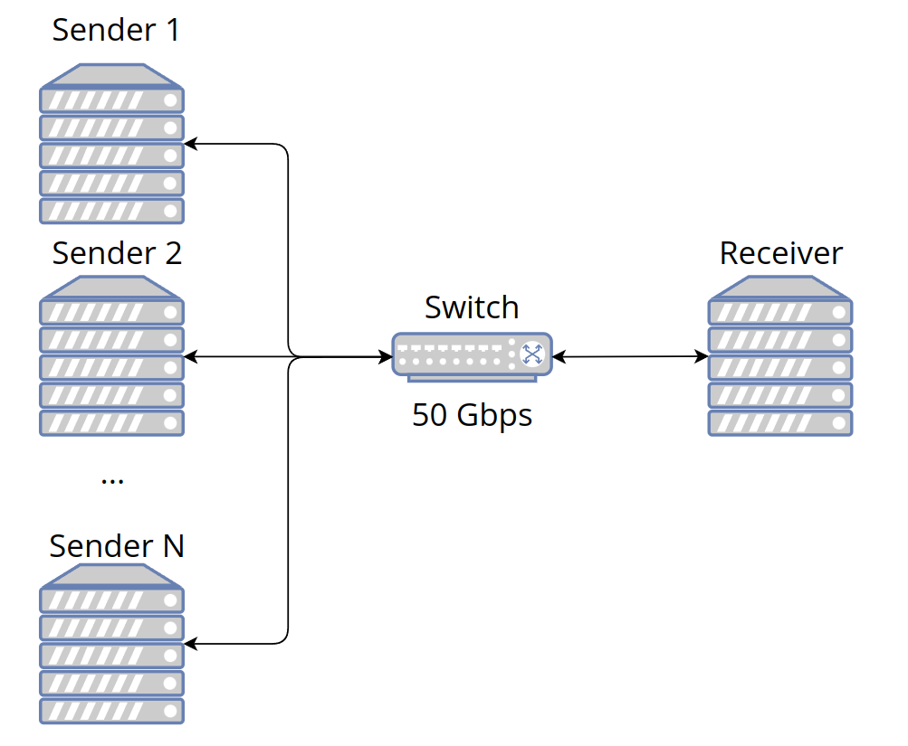
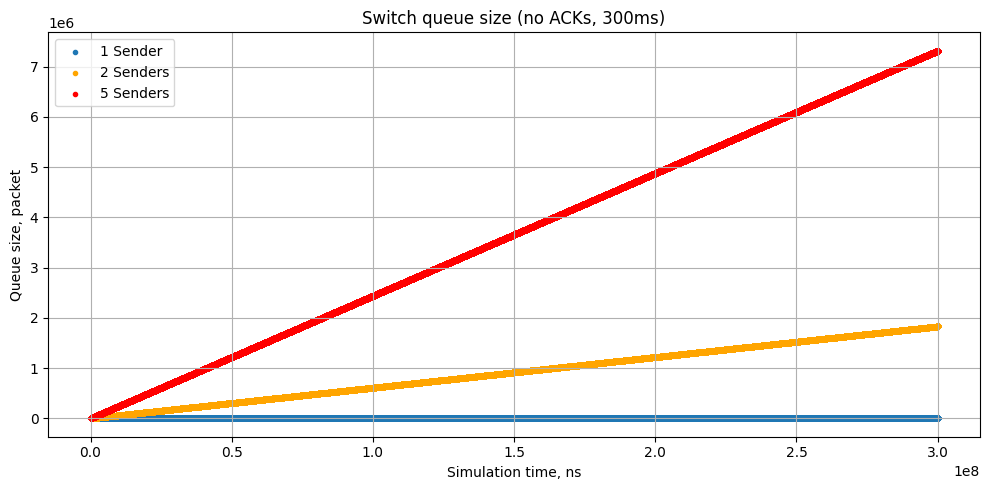
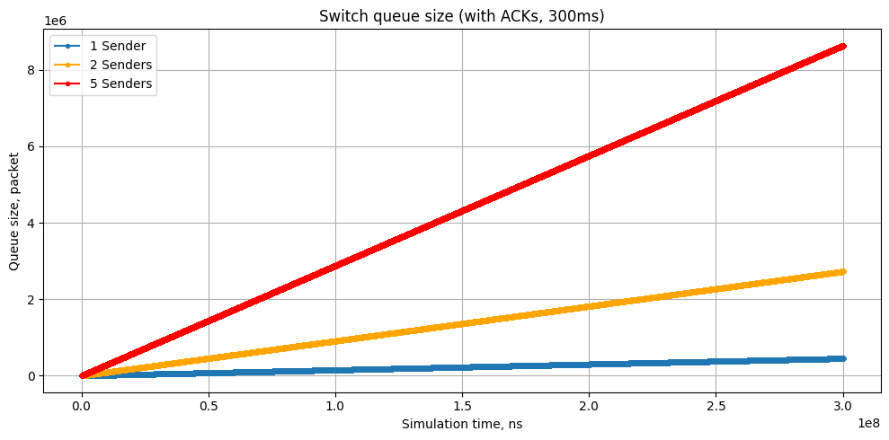
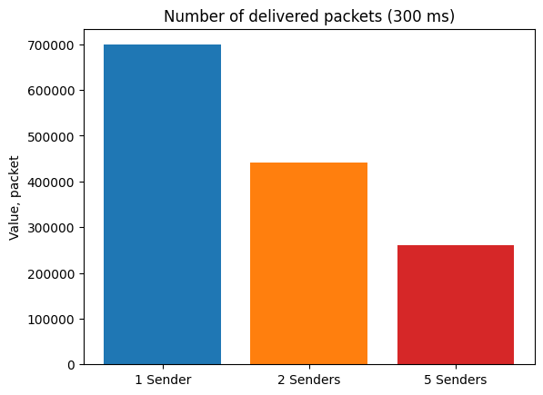

## Проект 1: Моделирование перегрузки сети в дата-центре на C++
## Студент: Иван Шаныгин

### Build

```bash
mkdir build && cd build
```
```bash
cmake ..
```
```bash
cmake --build .
```
Run **program**:
```bash
./network_simulator
```

### Usage

```cpp
#include "NetworkSimulator.hpp"

#include <memory>

int main() {
    NetworkSimulator ns;

    // Sender
    std::shared_ptr<Sender> sender = std::make_shared<Sender>(100);

    // Switch
    std::shared_ptr<Switch> s = std::make_shared<Switch>(100);

    // Receiver
    std::shared_ptr<Receiver> receiver = std::make_shared<Receiver>(100);

    std::shared_ptr<Link> link1 = std::make_shared<Link>(sender, s, 100);
    std::shared_ptr<Link> link2 = std::make_shared<Link>(s, receiver, 100);

    std::shared_ptr<Flow> flow = std::make_shared<Flow>(sender, receiver, 100);

    // Add devices to simulator
    NetworkSimulator::AddDevice(s);
    NetworkSimulator::AddDevice(sender);
    NetworkSimulator::AddDevice(receiver);

    NetworkSimulator::AddLink(link1, flow);
    NetworkSimulator::AddLink(link2, flow);

    NetworkSimulator::AddFlow(flow);

    // Turn on ACKs
    NetworkSimulator::EnableACK = true;
    // Set stop time
    ns.StopAt(Time::Milliseconds(300));
    // Add logging to files
    NetworkSimulator::logger.Setup("../rtt.txt", "../queue_size.txt");

    // Start simulation
    ns.Run();
}
```

## Simulation

### One sender 



Queue size without ACKs:



Queue size with ACKs:



Number of received ACKs:



Simulation time = 300ms.
